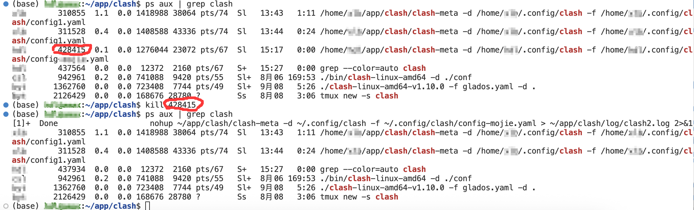

# clash-meta for linux配置

### 下载并启动clash

**下载**

```bash
mkdir -p ~/app/clash && cd ~/app/clash
```

```bash
git clone https://github.com/nightbreezerises/clash.git
```

如下载失败可以在外部下载再传到服务器上

**设置可执行权限**

```bash
chmod +x ~/app/clash/clash-meta
```

**修改配置文件**

配置文件目录放在~/app/clash/config，可以写多个配置文件，只需要修改一下启动命令即可

下面是对配置文件~/app/clash/config/config1.yaml的修改


**后台启动**：

```bash
mkdir -p ~/app/clash/config ~/app/clash/log
nohup ~/app/clash/clash-meta -d ~/app/clash/config -f ~/app/clash/config/config1.yaml > ~/app/clash/log/clash1.log 2>&1 &
```

### 测试

查看日志：

```bash
cat ~/app/clash/log/clash1.log
```

配置环境变量（当前终端生效）：

```bash
export http_proxy="http://127.0.0.1:7890" https_proxy="http://127.0.0.1:7890" all_proxy="socks5://127.0.0.1:7890"
```

查看环境变量是否设置成功

```bash
echo "http_proxy=$http_proxy"; echo "https_proxy=$https_proxy"; echo "all_proxy=$all_proxy"
```

访问外网，以谷歌为例查看是否配置成功

```bash
curl -I https://www.google.com
```

查看ip所在地区

```bash
curl -v ifconfig.co/json
```

### dashboard切换节点

浏览器打开 ip:9090/ui 或 域名:9090/ui/,

假如我的远程服务器IP是[210.23.67.36](https://link.zhihu.com/?target=http%3A//210.24.87.32%3A9090/)，所以在浏览器中打开[http://210.23.67.36:9090/](https://link.zhihu.com/?target=http%3A//210.24.87.32%3A9090/)ui


### 关闭clash

查看进程

```bash
ps aux | grep clash
```

关闭进程示例（格式为`kill 'pid'`）

